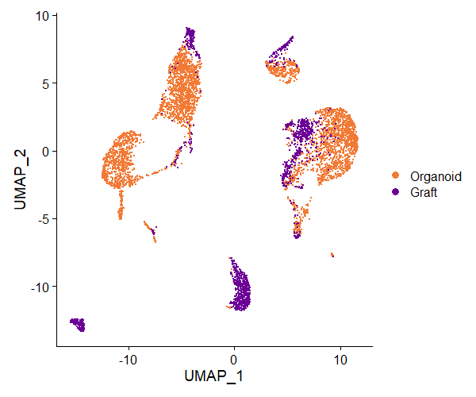
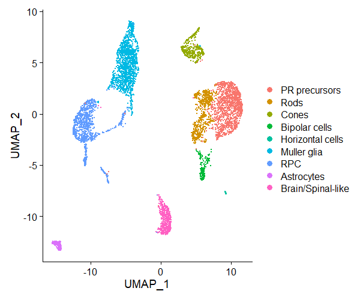

# Single cell RNA-Seq of transplanted human organoids into the degenerating rd1 mouse retina

10x Single-cell RNA sequencing (scRNA-seq) data from the study of transplanted human retinal organoids into the subretinal space of degenerating rd1 mouse retinas which is accessible on bioRxiv:

 
 
 
 
 
 
 
 
 
 
 
 
 

### Sample Information
The following contains sample information for the scRNA-seq runs.

| Condition        | Replicate Number           | Sample Name  |
| ------------- |:-------------:|:-----:|
Cultured organoid | 1 |hgorg1
Cultured organoid | 2 |hgorg2
Transplant organoid | 1 |rd1_hgorg1
Transplant organoid | 2 |rd1_hgorg2
Transplant organoid | 3 |rd1_hgorg3

### Count Matrix
The cell by gene count matrix contains the gene counts for the merged dataset used in this study and is provided in .csv format and can be downloaded here:
[counts.csv](https://www.dropbox.com/)

### Meta Data 
The metadata file contains the assigned clusters, celltype annotations and UMAP coordinates that were used in the study.
The metadata is provided in .csv format and can be downloaded here:
[metadata.csv](https://www.dropbox.com/)
